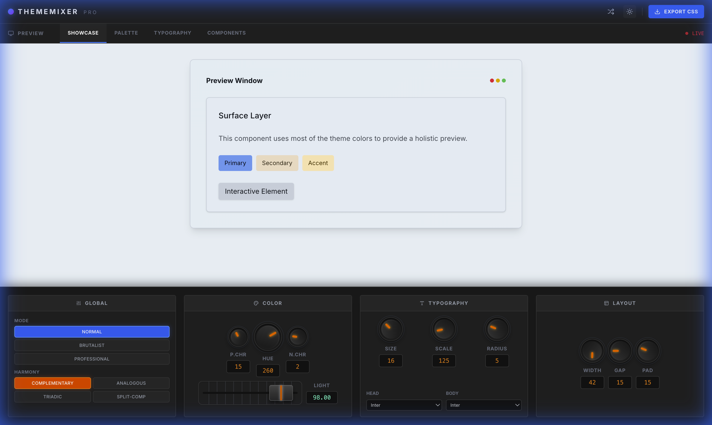

# Theme Mixer

Theme Mixer is a powerful and intuitive web application designed for creating, customizing, and managing color themes. With a sleek, mixer-style interface, users can fine-tune color parameters, visualize changes in real-time, and export their themes for use in various projects.



## Features

- **Visual Color Mixing**: Adjust color channels (RGB, HSL, CMYK) using intuitive faders and knobs.
- **Real-time Preview**: See your changes instantly as you mix colors.
- **Theme Management**: Save, load, and organize multiple themes.
- **Export Options**: Export themes in various formats (CSS, JSON, etc.) for easy integration.
- **Responsive Design**: Works seamlessly on desktop and tablet devices.
- **Modern UI**: Built with a premium, dark-mode aesthetic for a professional look and feel.

## Tech Stack

- **Frontend Framework**: [React](https://react.dev/)
- **Language**: [TypeScript](https://www.typescriptlang.org/)
- **Build Tool**: [Vite](https://vitejs.dev/)
- **Styling**: [Tailwind CSS](https://tailwindcss.com/)
- **Icons**: [Lucide React](https://lucide.dev/)

## Getting Started

Follow these steps to get the project running locally on your machine.

### Prerequisites

- [Node.js](https://nodejs.org/) (version 20.19+ or 22.12+)
- [npm](https://www.npmjs.com/) or [pnpm](https://pnpm.io/)

### Installation

1. **Clone the repository**

   ```bash
   git clone https://github.com/manyeya/theme-mixer.git
   cd theme-mixer
   ```

2. **Install dependencies**

   ```bash
   npm install
   # or
   pnpm install
   ```

3. **Start the development server**

   ```bash
   npm run dev
   # or
   pnpm dev
   ```

4. **Open the application**

   Open your browser and navigate to `http://localhost:5173/theme-mixer/` to start mixing themes!

## Usage

1. **Select a Color Channel**: Choose between RGB, HSL, or CMYK modes.
2. **Adjust Faders**: Use the vertical faders to adjust individual color components.
3. **Fine-tune with Knobs**: Use the rotary knobs for precise control over saturation, brightness, or other parameters.
4. **Save Theme**: Click the "Save" button to store your current configuration.
5. **Export**: Use the export feature to generate code snippets for your theme.

## License

This project is licensed under the MIT License - see the [LICENSE](LICENSE) file for details.
